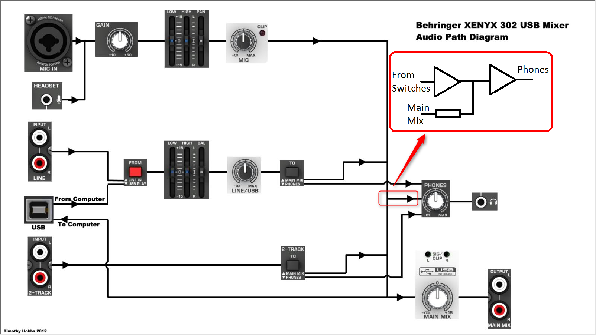
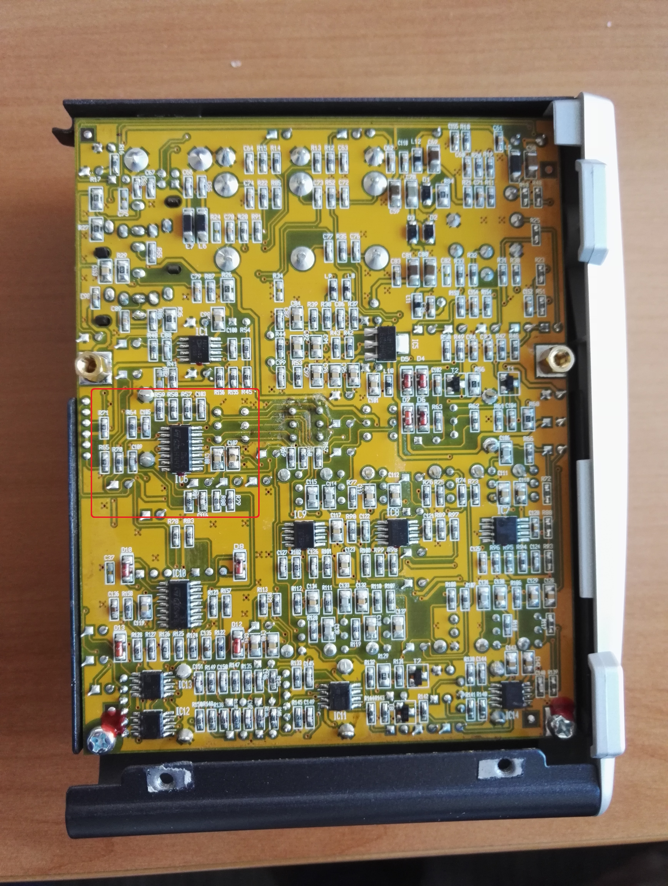
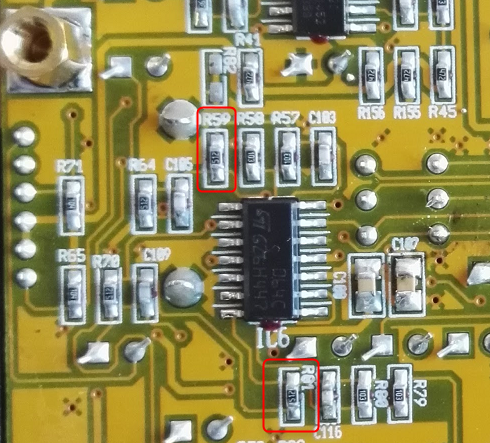

## Behringer Xenyx 302USB no master monitor mod ##

**Disclaimer: Doing this modification voids your warrany. If you never soldered before, you probably shouldn't start with this. I warned you: If you make any damage in yourself, your mixer, or anything else, I'm not responsible. I won't do this modification for you, even if you're willing to pay. If you have any constructive info to add, I'm glad to merge pull requests. I will likely ignore all other messages regarding the topic.**

Behringer Xenyx 302USB is a great little mixer, and quite usable even if you just need a better-then-integrated quality sound card. However, if you use it as a soundcard, it has a drawback: You can always hear the "Main mix" channel on the phones, and the microphone channel is always on the main mix channel. This is especially annoying during skype or similar voip calls: you must have the mic on the main mix, because otherwise you can't send your voice to the other party, but this means that you must hear yourself on the phones.

If your the visual type, you can see this in the following block diagram, originally drawn by [Timothy Hobbs for his explanation on youtube.](https://www.youtube.com/watch?v=pmKdOm7oibM)

If we could cut the line marked with the red rectangle, that would remove the main mix from the phones. Even the 0 delay monitoring is available, if you usually record to you computer and don't mind plugging your headphone to the main mix output.

Internally, that part actually looks like what's drawn in the red framing: The "monitor" (or "phones") signal from the 2track and line in switch goes into an opamp, then the main mix is added through a resistor, and the mixed signal goes into another opamp. That resistor - actually resistors, since it's a stereo mixer so you have two channels - can be found on the PCB and removed. If you want, you can even make it switchable, although there isn't much space for a switch in the case.

First of all, you need to get access to the bottom of the PCB. Remove the right plastic cover (the one closer to the main mix pot), then remove the bottom cover (it should slip out sideways after you unscrewed it). You should see something like this:

I marked the quad-opamp and its sourrounding resistor's we're interested in. On the next picture, you can see which resistors to remove (R59 and R81, both of them are 5.1k):

That's it!

**Disclaimer: Doing this modification voids your warrany. If you never soldered before, you probably shouldn't start with this. I warned you: If you make any damage in yourself, your mixer, or anything else, I'm not responsible. I won't do this modification for you, even if you're willing to pay. If you have any constructive info to add, I'm glad to merge pull requests. I will likely ignore all other messages regarding the topic**

Feel free to do whatever you want with this documentation, but mark the original source, which is github.com/andrasbiro